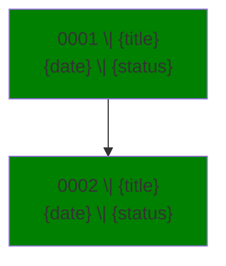
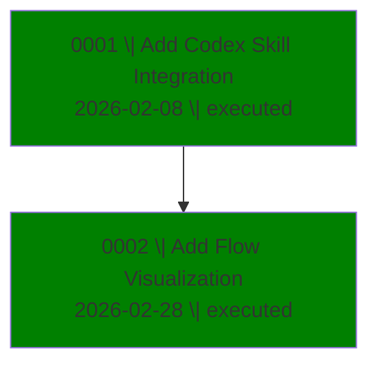

# AgDR Flow Visualization

Generate a Mermaid flowchart and markdown table showing all AgDR decisions in the repository.

## When to Use

Use when user wants to see an overview of all decisions:
- "Show me the AgDR history"
- "What decisions have been made?"
- "Visualize all AgDRs"
- "Overview of technical decisions"

## Output Destination

Write the generated markdown to: `docs/agdr/flow.md`

Also display the content in chat so user can see it immediately.

---

## Step-by-Step Instructions

### Step 1: Discover AgDR Files

Find all AgDR markdown files:
- Directory: `docs/agdr/`
- Pattern: `AgDR-*.md`
- Sort by ID number (ascending)

**Edge case:** If no files found, generate a placeholder output saying "No AgDR files found in docs/agdr/" and stop.

### Step 2: Parse Each AgDR

For each file, extract these fields:

**From Frontmatter (YAML between `---`):**
| Field | Required | Fallback |
|-------|----------|----------|
| `id` | Yes | Derive from filename: `AgDR-XXXX` |
| `status` | Yes | `unknown` |
| `timestamp` | No | Empty |
| `agent` | No | `unknown` |
| `supersedes` | No | Empty |

**From Body:**
- **Title**: First `# Heading` line (remove the `# `)
- **References**: Any markdown link matching `[...](...AgDR-XXXX...)`

### Step 3: Extract Date

Parse `timestamp` to `YYYY-MM-DD` format. If parsing fails or field is empty, leave blank.

### Step 4: Build Relationships

**Chronological edges** (solid line `-->`):
- Sort AgDRs by ID
- Connect sequential: 0001 → 0002 → 0003

**Superseded edges** (dashed line `-.->`):
- If `supersedes: AgDR-XXXX` exists, add: XXXX → current

**Reference edges** (double arrow `==>`):
- For each link to another AgDR, add: current → referenced

**Skip self-loops:** Don't create edges where source equals target.

### Step 5: Generate Output

Create markdown with three sections:

1. **Summary** - Statistics
2. **Table** - Quick scan of all decisions
3. **Mermaid** - Visual diagram

---

## Status Colors

| Status | Color |
|--------|-------|
| executed | green |
| proposed | orange |
| superseded | gray |
| unknown | gray |

Apply with: `style 0001 fill:green`

---

## Output Template

```markdown
## AgDR Summary
- **Total**: {count} decisions
- **By Status**: Executed: {n} | Proposed: {n} | Superseded: {n}
- **By Agent**: {agent}: {n} | {agent}: {n}

## AgDR Table

| ID | Title | Status | Agent | Date |
|---|---|---|---|---|
| 0001 | {title} | {status} | {agent} | {date} |

## AgDR Flow



**Legend:**
- `-->` chronological
- `-.->` superseded by
- `==>` references
```

---

## Example Output

```markdown
## AgDR Summary
- **Total**: 2 decisions
- **By Status**: Executed: 2 | Proposed: 0 | Superseded: 0
- **By Agent**: codex: 2

## AgDR Table

| ID | Title | Status | Agent | Date |
|---|---|---|---|---|
| 0001 | Add Codex Skill Integration | executed | codex | 2026-02-08 |
| 0002 | Add Flow Visualization | executed | codex | 2026-02-28 |

## AgDR Flow



**Legend:**
- `-->` chronological
- `-.->` superseded by
- `==>` references
```

---

## Troubleshooting

| Issue | Solution |
|-------|----------|
| No files found | Check `docs/agdr/` exists with `AgDR-*.md` files |
| Missing `id` field | Derive from filename (e.g., `AgDR-0001-slug.md` → `AgDR-0001`) |
| Missing title | Use filename without extension |
| Missing status | Use `unknown` |
| Date parse fails | Leave date field empty |
| Self-loop edge | Skip it (don't create edge where source = target) |
