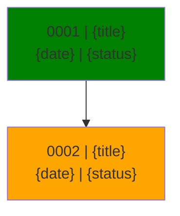
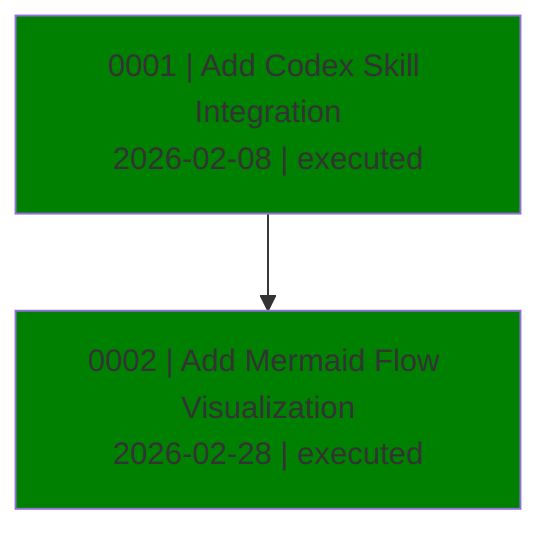

# AgDR Flow Visualization

Generate a Mermaid flowchart and markdown table showing all AgDR decisions in the repository.

## When to Use

Use when user wants to see an overview of all decisions made, such as:
- "Show me the AgDR history"
- "What decisions have been made?"
- "Visualize all AgDRs"
- "Overview of technical decisions"

## Output Format

Generate a markdown file with three sections:

1. **Summary** - Statistics about decisions
2. **Table** - Quick scanning of all decisions
3. **Mermaid Diagram** - Visual relationship of decisions

---

## Step-by-Step Instructions

### Step 1: Discover AgDR Files

Find all AgDR markdown files in the `docs/agdr/` directory:
- Files matching pattern: `AgDR-*.md`
- Sort by filename (extracts ID naturally)

### Step 2: Parse Each AgDR

For each AgDR file, extract these fields from the markdown:

**From Frontmatter (YAML between `---`):**
- `id` - e.g., "AgDR-0001"
- `status` - executed | proposed | superseded
- `timestamp` - ISO date format
- `agent` - which AI made the decision
- `supersedes` - ID of replaced decision (if any)

**From Body:**
- Title: First `# Heading` (without the #)
- References: Find markdown links to other AgDRs like `[AgDR-0001](docs/agdr/AgDR-0001-filename.md)`

### Step 3: Extract Date

Parse `timestamp` to get `YYYY-MM-DD` format.

### Step 4: Build Relationships

**Chronological edges:**
- Sort AgDRs by ID number
- Connect in sequence: 0001 → 0002 → 0003

**Superseded edges:**
- If `supersedes: AgDR-XXXX`, add: `XXXX → current` (dashed line)

**Reference edges:**
- For each markdown link to another AgDR, add: `current → referenced` (double arrow)

### Step 5: Generate Output

Write markdown with these sections:

---

## Output Template

Copy and fill in:

```markdown
## AgDR Summary
- **Total**: {count} decisions
- **By Status**: {executed_count} executed | {proposed_count} proposed | {superseded_count} superseded
- **By Agent**: {agent1}: {count1} | {agent2}: {count2} | ...

| ID | Title | Status | Agent | Date |
|---|---|---|---|---|
| 0001 | {title} | {status} | {agent} | {date} |
| 0002 | {title} | {status} | {agent} | {date} |



**Edge Legend:**
- `--> ` : chronological (sequence)
- `-.->` : superseded by
- `==>` : references
```

---

## Status Color Mapping

| Status | Color | Mermaid Style |
|--------|-------|---------------|
| executed | green | `fill:green` |
| proposed | orange | `fill:orange` |
| superseded | gray | `fill:gray` |
| unknown | gray | `fill:gray` |

---

## Example Output

For 2 AgDRs with IDs 0001 and 0002:

```markdown
## AgDR Summary
- **Total**: 2 decisions
- **By Status**: Executed: 2
- **By Agent**: codex: 2

| ID | Title | Status | Agent | Date |
|---|---|---|---|---|
| 0001 | Add Codex Skill Integration | executed | codex | 2026-02-08 |
| 0002 | Add Mermaid Flow Visualization | executed | codex | 2026-02-28 |



**Edge Legend:**
- `--> ` : chronological (sequence)
- `-.->` : superseded by
- `==>` : references
```

---

## Troubleshooting

- **No files found**: Check that `docs/agdr/` exists with `AgDR-*.md` files
- **Missing fields**: Use sensible defaults (unknown status, filename as title)
- **Date parsing failed**: Use the date from filename or leave empty
